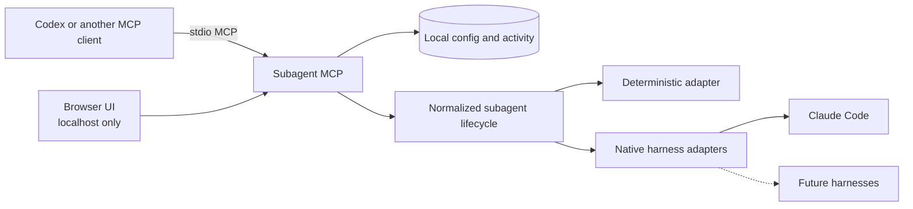

# Subagent MCP

Subagent MCP gives Codex and other stdio MCP clients one local lifecycle for
delegating work to external coding-agent harnesses. Each adapter uses the
provider's native harness while Subagent MCP keeps status, sessions, input, and
results consistent for the client.

The project and repository are named **Subagent MCP**. The Python distribution
and command are **`subagent-harness-mcp`** because the shorter package name was
already taken.

> **Preview:** `0.1.0a2` targets Windows. The local MCP, deterministic adapter,
> package, and localhost UI are usable. Live Claude Code work remains gated
> until the exact native-harness and no-overage canary passes.

## Install

Install [uv](https://docs.astral.sh/uv/getting-started/installation/) first if
you do not already have it:

```powershell
winget install --id=astral-sh.uv -e
```

Then install the pinned preview and connect it to Codex:

```powershell
uv tool install subagent-harness-mcp==0.1.0a2
codex mcp add subagent-mcp -- subagent-harness-mcp serve
```

Start a new Codex task after registration. You can confirm the installation at
any time:

```powershell
subagent-harness-mcp --version
codex mcp list
```

If `0.1.0a2` has not reached PyPI yet, install the current checkout instead:

```powershell
uv tool install .
```

## Open the local UI

```powershell
subagent-harness-mcp ui
```

This opens a temporary browser session on localhost for settings, health, and
read-only activity. It is not an agent chat window, and the server stops when
the command exits.

## How it fits together



The service owns lifecycle state, idempotency, redaction, leases, and circuits.
Adapters translate that contract to a native harness and do not write shared
state directly. See [the architecture](docs/architecture.md) for details.

## What works in this preview

| Capability | Status |
|---|---|
| 13-tool normalized lifecycle over stdio | Works |
| Deterministic adapter for integration testing | Works without provider quota |
| Localhost settings and activity UI | Works |
| Windows install, update, rollback, registration, and conservative uninstall | Implemented; final public-install verification is pending |
| Claude Code native adapter | Implemented but remains `needs_canary` until its live no-overage gate passes |
| Provider model selection | Opaque native model IDs; no hard-coded model allowlist or silent fallback |
| Project-local Claude context and hooks | Disabled until canonical path and content-hash trust are enforced |
| macOS, Linux, visible-background handoff, and native client side-panel rows | Not supported in this preview |

Green deterministic tests prove the local contract; they do not prove that a
live provider is ready.

## Other MCP clients

Point any stdio-compatible MCP client at the installed command:

```json
{
  "command": "subagent-harness-mcp",
  "args": ["serve"]
}
```

The MCP exposes versioned runtime, project-trust, agent-lifecycle, and workspace
tools. Public schemas live in [`schemas/`](schemas/).

## Safety and billing

- Subagent MCP never enables usage credits or changes billing settings.
- Managed provider work fails closed on missing identity, model, workspace,
  session, or no-overage evidence; it does not silently choose a fallback.
- Provider model IDs and reasoning settings remain native, opaque values.
- Product data stays in explicit local config, state, and data roots. Optional
  client registration uses the client's official command and verifies the exact
  entry instead of directly rewriting unrelated configuration.
- Native transcripts remain owned by the native harness. Treat agent output as
  untrusted advice and verify it before applying changes.

Read the full [threat model](docs/threat-model.md) and report vulnerabilities
privately as described in [SECURITY.md](SECURITY.md).

## Development

[CONTRIBUTING.md](CONTRIBUTING.md) contains the deterministic test workflow and
adapter guidelines. Subagent MCP is released under the [MIT License](LICENSE).
