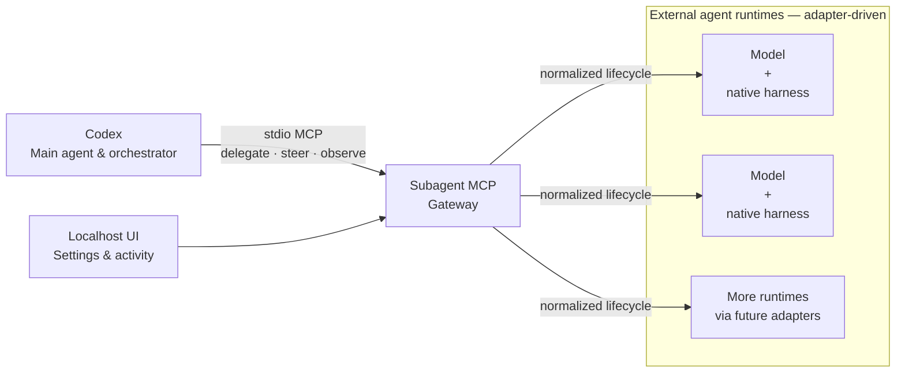

# Subagent MCP

Most agent setups ask one model inside one harness to plan, implement, and
review the same work. That can leave the same assumptions in every role —
closer to grading your own homework than getting an independent review.

Subagent MCP lets Codex remain the main agent and orchestrator while delegating
work to external agent runtimes. An external agent runtime is a model paired
with its native harness. Claude with Claude Code, a Cursor-supported model with
Cursor's harness, and Qwen with its native harness are examples, not hard-coded
branches: adapters connect each runtime through the same normalized lifecycle.

These runtimes supplement Codex's native subagent pool. Where a native harness
supports subscription-backed use, work can draw on that provider's existing
quota; actual concurrency and capabilities still depend on installed adapters
and provider limits. Subagent MCP does not enable usage credits or overage, and
managed provider work fails closed when no-overage evidence or required
identity, model, workspace, or session data is missing.

The project and repository are named **Subagent MCP**. The Python distribution
and command are **`subagent-harness-mcp`** because the shorter package name was
already taken.

> **Preview:** `0.1.0a4` targets Windows. The local MCP, deterministic adapter,
> package, and localhost UI are usable. Live Claude Code work remains gated
> until the exact native-harness and no-overage canary passes.

## Install

Install [uv](https://docs.astral.sh/uv/getting-started/installation/) first if
you do not already have it:

```powershell
winget install --id=astral-sh.uv -e
```

Then install the pinned preview and connect it to Codex:

```powershell
uv tool install subagent-harness-mcp==0.1.0a4
codex mcp add subagent-mcp -- subagent-harness-mcp serve
```

Start a new Codex task after registration. You can confirm the installation at
any time:

```powershell
subagent-harness-mcp --version
codex mcp list
```

If `0.1.0a4` has not reached PyPI yet, install the current checkout instead:

```powershell
uv tool install .
```

## Open the local UI

```powershell
subagent-harness-mcp ui
```

This opens a temporary browser session on localhost for settings, health, and
read-only activity. It is not an agent chat window, and the server stops when
the command exits.

## Use it from Codex

After registering the server and configuring a runtime, start a new Codex task
and delegate in natural language. For example:

> Use Subagent MCP to ask an external agent to review this change, then
> evaluate its findings independently.

Codex decides what to delegate, observes the result, and keeps the final
judgment. Underneath, each adapter maps the same lifecycle to its native
harness: spawn, inspect or wait, send follow-up input or interrupt, then close.

## How it fits together



A runtime may be Claude with Claude Code, a Cursor-supported model with
Cursor's harness, Qwen with its native harness, or another adapter. These are
examples of the adapter shape, not special cases in the architecture.

Subagent MCP owns the normalized lifecycle, status, redaction, leases, and
circuits. Each adapter translates that contract to its native harness without
writing shared state directly. See [the architecture](docs/architecture.md)
for details.

## What works in this preview

| Capability | Status |
|---|---|
| 13-tool normalized lifecycle over stdio | Works |
| Deterministic adapter for integration testing | Works without provider quota |
| Localhost settings and activity UI | Works |
| Windows install, update, rollback, registration, and conservative uninstall | Implemented; final public-install verification is pending |
| Claude Code native adapter | Implemented but remains `needs_canary` until its live no-overage gate passes |
| Provider model selection | Opaque native model IDs; no hard-coded model allowlist or silent fallback |
| Project-local Claude context and hooks | Disabled until canonical path and content-hash trust are enforced |
| macOS, Linux, visible-background handoff, and native client side-panel rows | Not supported in this preview |

Green deterministic tests prove the local contract; they do not prove that a
live provider is ready.

## Other MCP clients

Point any stdio-compatible MCP client at the installed command:

```json
{
  "command": "subagent-harness-mcp",
  "args": ["serve"]
}
```

The MCP exposes versioned runtime, project-trust, agent-lifecycle, and workspace
tools. Public schemas live in [`schemas/`](schemas/).

## Safety and billing

- Subagent MCP never enables usage credits or changes billing settings.
- Managed provider work fails closed on missing identity, model, workspace,
  session, or no-overage evidence; it does not silently choose a fallback.
- Provider model IDs and reasoning settings remain native, opaque values.
- Product data stays in explicit local config, state, and data roots. Optional
  client registration uses the client's official command and verifies the exact
  entry instead of directly rewriting unrelated configuration.
- Native transcripts remain owned by the native harness. Treat agent output as
  untrusted advice and verify it before applying changes.

Read the full [threat model](docs/threat-model.md) and report vulnerabilities
privately as described in [SECURITY.md](SECURITY.md).

## Development

[CONTRIBUTING.md](CONTRIBUTING.md) contains the deterministic test workflow and
adapter guidelines. Subagent MCP is released under the [MIT License](LICENSE).
