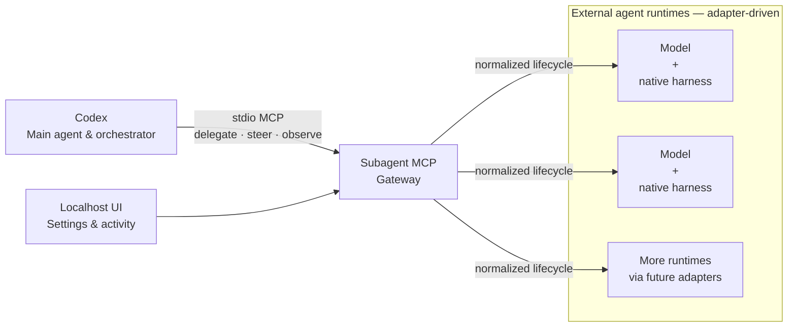

# Subagent MCP

<!-- mcp-name: io.github.Thang1710/subagent-mcp -->

One agent that plans, implements, and reviews the same work is also grading its
own assumptions. Subagent MCP keeps Codex as the main agent and orchestrator,
then lets it delegate bounded work to external agent runtimes. Each runtime is
an independent model paired with its native harness, so implementation and
review can come from a different model, context, and set of assumptions.

Adapters translate each native harness into one normalized lifecycle. The core
does not hard-code provider roles or model names. These runtimes supplement
Codex's native subagent pool and can use provider quota under an explicit
runtime billing policy. Subagent MCP never enables, purchases, auto-reloads, or
silently opts into usage credits or paid overage.

> **Preview:** `0.1.0a17` targets Windows. The local MCP, deterministic adapter,
> package, localhost UI, and Claude Code native-harness integration are ready.

### Runtime status

- **Claude Code — Ready.** It delegates through the native Claude Code harness,
  keeps model and reasoning choices provider-native, and verifies subscription
  OAuth identity plus live no-overage evidence before accepting its output.
  Current provider availability is shown separately in the localhost UI.
- **DeepSeek Harness — In development.** The current source includes a first
  native ACP vertical slice. It discovers a standard Windows Node install even
  when an MCP client filters `ProgramFiles`, and
  the source checkout linked by the native `~/.dsh` profile without depending
  on a separate web launcher. Initial provider-backed review proof has passed;
  broader provider and lifecycle coverage remains in progress. Billing may use
  credits or unlimited offers the user already authorizes; auto-top-up and
  overage are never enabled.

## Install

Install [uv](https://docs.astral.sh/uv/getting-started/installation/) first if
you do not already have it:

```powershell
winget install --id=astral-sh.uv -e
```

Then install the pinned preview and connect it to Codex:

```powershell
uv tool install subagent-harness-mcp==0.1.0a17
codex mcp add subagent-mcp -- subagent-harness-mcp serve
```

Start a new Codex task after registration. You can confirm the installation at
any time:

```powershell
subagent-harness-mcp --version
codex mcp list
```

If `0.1.0a17` has not reached PyPI yet, install the current checkout instead:

```powershell
uv tool install .
```

## Open the local UI

```powershell
subagent-harness-mcp ui
```

This opens `http://127.0.0.1:8765` for settings, health, and read-only activity.
It does not require the MCP server to be active. The default foreground command
runs until you press `Ctrl+C`; the page is not an agent chat window.

To keep the UI available after the terminal closes, start the optional managed
background process. It remains independent of MCP until you stop it or the
Windows session ends:

```powershell
subagent-harness-mcp ui --background
subagent-harness-mcp ui --status
subagent-harness-mcp ui --stop
```

Use `--background --no-open` when you want the service available without
opening a browser tab. Subagent MCP does not add itself to Windows login or
startup automatically.

Choose another fixed port, or ask the OS for a temporary one, when needed:

```powershell
subagent-harness-mcp ui --port 9123
subagent-harness-mcp ui --port 0
```

Background mode requires a fixed port so status and graceful stop target the
same loopback service.

On Windows, stop the background UI before upgrading or removing the `uv` tool
so the running Python environment does not hold package files open:

```powershell
subagent-harness-mcp ui --stop
uv tool install --reinstall subagent-harness-mcp==0.1.0a17
```

## Use it from Codex

After registering the server and configuring a runtime, start a new Codex task
and delegate in natural language. For example:

> Use Subagent MCP to ask an external agent to review this change, then
> evaluate its findings independently.

Codex decides what to delegate, observes the result, and keeps the final
judgment. Underneath, each adapter maps the same lifecycle to its native
harness: spawn, inspect or wait, send follow-up input or interrupt, then close.

### Configure DeepSeek Harness (development)

Install and configure DeepSeek Harness normally, then open the Subagent MCP UI
and enable **DeepSeek Harness**. Enter the exact native model as
`provider-name::model-id`; Subagent MCP does not maintain a provider or model
allowlist. The adapter uses DeepSeek Harness's native ACP transport, not its web
UI.

The primary model is followed by an optional **Fallback models (in order)**
list. Enter one exact model ID per line. Codex moves to the next configured
variant only after the current provider explicitly reports exhausted quota or
credit (`QUOTA_PAUSED`); ambiguous failures, timeouts, and crashes are reported
without an automatic retry. No model, including Ox Alpha, is selected by
default for public users.

Enabling this runtime authorizes the selected route to consume quota from an
existing subscription or unlimited offer, or an already funded provider
balance. Subagent MCP does not purchase, reload, or increase that balance and
cannot verify a promotion or price that the native harness does not expose.

On Windows, the adapter discovers Node from `PATH` or the standard Program
Files installation and follows the native `~/.dsh` profile link to the source
checkout. Non-standard installations can set `SUBAGENT_MCP_DSH_NODE` and
`SUBAGENT_MCP_DSH_SOURCE_ROOT` before starting the MCP or UI.

To keep Codex supervision lean, leave lifecycle responses in their default
`compact` mode and use one `agent_wait` call with its five-minute default. The
MCP waits locally and wakes Codex only for completion, required input, or a
timeout; request `full` mode only when diagnosing a problem. Native agents are
asked for final-only reports, and returned final text is capped at 4,096
characters so hidden reasoning and long work logs do not inflate the controller
context.

## How it fits together



A runtime may be Claude with Claude Code, a Cursor-supported model with
Cursor's harness, Qwen with its native harness, or another adapter. These are
examples of the adapter shape, not special cases in the architecture.

Subagent MCP owns the normalized lifecycle, status, redaction, leases, and
circuits. Each adapter translates that contract to its native harness without
writing shared state directly. See [the architecture](docs/architecture.md)
for details.

## What works in this preview

| Capability | Status |
|---|---|
| 13-tool normalized lifecycle over stdio | Works |
| Deterministic adapter for integration testing | Works without provider quota |
| Separately packaged sample adapter and public conformance runner | Works from an installed wheel |
| Localhost settings and activity UI | Works |
| Windows install, update, rollback, registration, and conservative uninstall | Artifact install acceptance passes for `0.1.0a17` |
| Claude Code native adapter | Ready in the Windows preview |
| Provider model selection | Opaque native model IDs; user-ordered fallback only after explicit quota exhaustion |

Live provider availability still depends on the user's installed native
harness, authentication, selected model, and current provider limits.

## Other MCP clients

Point any stdio-compatible MCP client at the installed command:

```json
{
  "command": "subagent-harness-mcp",
  "args": ["serve"]
}
```

The MCP exposes versioned runtime, project-trust, agent-lifecycle, and workspace
tools. Public schemas live in [`schemas/`](schemas/).

## Safety and billing

- Subagent MCP never enables usage credits or changes billing settings.
- Each Claude turn is a bounded live native-harness request. The adapter accepts
  its output only after `claude auth status`, the live OAuth init event, and a
  safe no-overage rate event agree. Missing or unsafe evidence interrupts the
  request and discards its output.
- Claude exposes that rate evidence only on the live stream, so this guard can
  consume included subscription quota. It cannot inspect or change Claude's
  account-level usage-credit toggle; subscription-only users must keep usage
  credits disabled in Claude. Subagent MCP never turns them on.
- Missing local model, workspace, or session configuration blocks launch. Live
  identity or rate mismatches interrupt before output is accepted. A configured
  fallback is selected only after an explicit `QUOTA_PAUSED` result; ambiguous
  failures never trigger another paid request.
- Provider Refresh is a no-model preflight. It never launches a canary or task;
  when a native harness cannot expose pre-turn quota evidence, the UI reports
  `Unknown` instead of spending provider quota to manufacture an answer.
- Provider model IDs and reasoning settings remain native, opaque values.
- Product data stays in explicit local config, state, and data roots. Optional
  client registration uses the client's official command and verifies the exact
  entry instead of directly rewriting unrelated configuration.
- Native transcripts remain owned by the native harness. Treat agent output as
  untrusted advice and verify it before applying changes.

Read the full [threat model](docs/threat-model.md) and report vulnerabilities
privately as described in [SECURITY.md](SECURITY.md).

## Development

[CONTRIBUTING.md](CONTRIBUTING.md) contains the deterministic test workflow and
adapter guidelines. Subagent MCP is released under the [MIT License](LICENSE).
