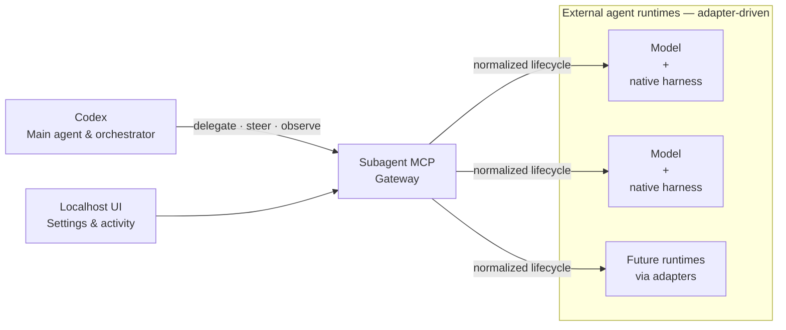

# Subagent MCP

<!-- mcp-name: io.github.Thang1710/subagent-mcp -->

**Independent harnesses. One Codex orchestrator.**

When one model plans a change, implements it, and reviews it, the reviewer shares
the author's context and blind spots. It can end up confirming its own plan
instead of testing it.

Subagent MCP keeps Codex as the main agent and final decision-maker while
delegating bounded work to external agent runtimes. Each runtime is a model
paired with its native harness, so Codex can get implementation or review from
an independent model with different context and assumptions.

That expands Codex's effective sub-agent pool and can use provider quota you
already have. Subagent MCP never enables, purchases, auto-reloads, or silently
opts into usage credits or paid overage.

Adapters translate every native harness into the same lifecycle: delegate,
observe, steer, and close. The core hard-codes no provider role or model name.

> **Stable:** `1.0.3` targets Windows. The MCP, package, localhost UI, and
> Claude Code and DeepSeek native-harness integrations are ready.

## Runtime status

- **Claude Code — Ready.** Uses the native Claude Code harness, provider-native
  model and reasoning settings, subscription OAuth identity, and live
  no-overage evidence before accepting its output.
- **DeepSeek Harness — Ready.** Uses its native ACP transport and
  harness-published model catalog for bounded tasks. Resume after an MCP restart,
  exact provider quota evidence, interactive input, and declared MCP remain
  explicit capability gaps.

No other runtime is supported yet. Future runtimes use adapters rather than
provider-specific branches in the core.

## Quick start

### 1. Install

Install [uv](https://docs.astral.sh/uv/getting-started/installation/) if needed,
then install the stable release and register it with Codex:

```powershell
winget install --id=astral-sh.uv -e
uv tool install subagent-harness-mcp==1.0.3
codex mcp add subagent-mcp -- uvx --from subagent-harness-mcp==1.0.3 subagent-harness-mcp serve
```

Start a new Codex task after registration.

### 2. Configure runtimes

```powershell
subagent-harness-mcp ui
```

The settings and read-only activity UI opens at
`http://127.0.0.1:8765`. It runs independently of the MCP server.

For a persistent background UI:

```powershell
subagent-harness-mcp ui --background
```

Any local browser can later open or reload `http://127.0.0.1:8765/` directly.
The UI does not depend on an active MCP connection.

### 3. Delegate

Ask Codex in plain language:

> Use Subagent MCP to ask an external agent to review this change, then
> evaluate its findings independently.

Codex chooses what to delegate, observes the result, and keeps the final
judgment. Lifecycle responses are compact by default; full redacted reports
remain in local product state and can be read or relayed later by hash-bound
reference.

## Models and fallback order

Each native harness publishes its own model choices. The UI shows friendly names
and an ordered priority stack; exact provider IDs remain available for advanced
routes.

When a provider explicitly reports exhausted quota or credit
(`QUOTA_PAUSED`), Subagent MCP moves that exact model to the bottom for future
tasks. It does not retry the failed task. Ambiguous failures, crashes, and
timeouts do not reorder models or trigger another paid request.

DeepSeek routes may use an existing subscription, unlimited offer, or funded
balance that the user authorizes. Subagent MCP never purchases, reloads, or
increases that balance.

## Concurrent writers

A write task can declare up to 32 repository-relative file or directory roots
in `write_set`. External writers may run concurrently when their canonical
absolute sets are disjoint. Equal paths and parent/child paths conflict; task
and lane names do not affect locking.

Omitting `write_set` gives the execution the whole workspace for backwards
compatibility. Each adapter also enforces the normalized paths at its native
harness boundary. These leases coordinate Subagent MCP executions; they are not
an operating-system sandbox for unrelated local processes.

## How it fits together



Subagent MCP owns lifecycle normalization, status, redaction, leases, and
circuits. Each adapter translates that contract to its native harness. See
[Architecture](docs/architecture.md) for the full contract.

## Update or roll back on Windows

If an older MCP entry launches `subagent-harness-mcp serve` directly, close
every Codex window once before this first migration; that legacy process shares
the persistent tool environment and may hold its executable open.

```powershell
subagent-harness-mcp ui --stop
uv tool install --reinstall subagent-harness-mcp==1.0.3
codex mcp remove subagent-mcp
codex mcp add subagent-mcp -- uvx --from subagent-harness-mcp==1.0.3 subagent-harness-mcp serve
subagent-harness-mcp ui --background
```

Use the same commands with the previous exact version to roll back. Subagent MCP
does not edit Codex configuration or clear uv caches on its own.

## Safety and billing

- Subagent MCP never enables usage credits or changes billing settings.
- Claude tasks can consume included subscription quota. Each task validates the
  bound CLI, subscription authentication, credential precedence, and control
  connection, then requires safe rate evidence from the same response before
  accepting its output.
- Provider Refresh sends no model prompt. If the native harness cannot expose
  exact rate evidence before a response, status remains unknown rather than
  inventing a quota result or using a reset clock.
- Fallback occurs only after explicit quota exhaustion. Unsafe or ambiguous
  evidence never triggers another paid request.
- Native transcripts remain owned by the native harness. Product state stays in
  explicit local roots, and agent output must be treated as untrusted advice.

Read [Security](SECURITY.md) and the
[Threat model](docs/threat-model.md) before enabling write access.

## Project

- [Architecture](docs/architecture.md)
- [Adapter authoring](docs/adapter-authoring.md)
- [Contributing](CONTRIBUTING.md)
- [Changelog](CHANGELOG.md)
- [MIT License](LICENSE)
