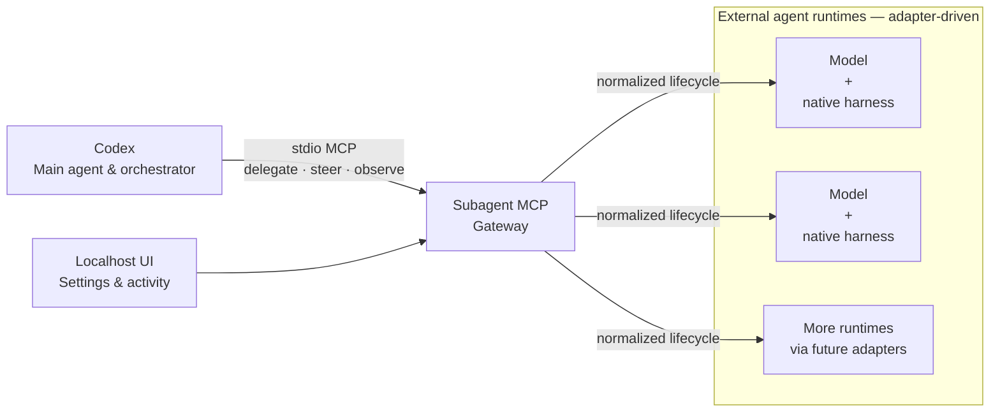

# README Model-Agnostic Gateway Implementation Plan

> **For agentic workers:** REQUIRED SUB-SKILL: Use superpowers:subagent-driven-development (recommended) or superpowers:executing-plans to implement this plan task-by-task. Steps use checkbox (`- [ ]`) syntax for tracking.

**Goal:** Reposition the public README around Codex as the main agent and Subagent MCP as a model-and-native-harness gateway, with a truthful quick-use path and a product-level diagram.

**Architecture:** This is a documentation-only change. `README.md` will use the generic term “external agent runtime” for a model paired with its native harness, keep named vendors outside architecture boxes, and preserve the preview's implemented-versus-gated boundaries.

**Tech Stack:** Markdown, Mermaid, Git, PowerShell verification

---

## File Structure

- Modify: `README.md` — public positioning, quick-use guidance, product-flow diagram, and current acceptance status.
- No runtime source, schema, configuration, or test file changes are part of this plan.

### Task 1: Rewrite the public positioning and product flow

**Files:**
- Modify: `README.md`

- [ ] **Step 1: Replace the opening description**

Keep the existing `# Subagent MCP` heading and replace the introductory paragraphs above the package-name note with this reviewed copy:

```markdown
Most agent setups ask one model inside one harness to plan, implement, and
review the same work. That can leave the same assumptions in every role —
closer to grading your own homework than getting an independent review.

Subagent MCP lets Codex remain the main agent and orchestrator while delegating
work to external agent runtimes. An external agent runtime is a model paired
with its native harness. Claude with Claude Code, a Cursor-supported model with
Cursor's harness, and Qwen with its native harness are examples, not hard-coded
branches: adapters connect each runtime through the same normalized lifecycle.

These runtimes supplement Codex's native subagent pool. Where a native harness
supports subscription-backed use, work can draw on that provider's existing
quota; actual concurrency and capabilities still depend on installed adapters
and provider limits. Subagent MCP does not enable usage credits or overage, and
managed provider work fails closed when no-overage evidence or required
identity, model, workspace, or session data is missing.
```

- [ ] **Step 2: Add the concrete Codex usage path**

Insert this section after `## Open the local UI` and before the product-flow diagram:

```markdown
## Use it from Codex

After registering the server and configuring a runtime, start a new Codex task
and delegate in natural language. For example:

> Use Subagent MCP to ask an external agent to review this change, then
> evaluate its findings independently.

Codex decides what to delegate, observes the result, and keeps the final
judgment. Underneath, each adapter maps the same lifecycle to its native
harness: spawn, inspect or wait, send follow-up input or interrupt, then close.
```

- [ ] **Step 3: Replace the implementation-heavy diagram**

Replace the current Mermaid block under `## How it fits together` with:



Follow it with this exact explanatory copy:

```markdown
A runtime may be Claude with Claude Code, a Cursor-supported model with
Cursor's harness, Qwen with its native harness, or another adapter. These are
examples of the adapter shape, not special cases in the architecture.

Subagent MCP owns the normalized lifecycle, status, redaction, leases, and
circuits. Each adapter translates that contract to its native harness without
writing shared state directly. See [the architecture](docs/architecture.md)
for details.
```

- [ ] **Step 4: Update the completed public-install status**

In the preview capability table, replace:

```markdown
| Windows install, update, rollback, registration, and conservative uninstall | Implemented; final public-install verification is pending |
```

with:

```markdown
| Windows install, update, rollback, registration, and conservative uninstall | Passed fresh public-user acceptance for `0.1.0a3` |
```

- [ ] **Step 5: Inspect the bounded diff**

Run:

```powershell
git diff -- README.md
```

Expected: only the opening, Codex usage section, product-flow diagram and adjacent explanation, and the one acceptance-status row change.

### Task 2: Verify public wording, rendering inputs, and privacy

**Files:**
- Verify: `README.md`

- [ ] **Step 1: Check Markdown whitespace**

Run:

```powershell
git diff --check
```

Expected: no output and exit code 0.

- [ ] **Step 2: Check that the old hard-coded diagram is gone**

Run:

```powershell
rg -n 'Codex or another MCP client|Deterministic adapter|Native harness adapters|N --> H|N -\.-> X' README.md
```

Expected: no matches and exit code 1.

- [ ] **Step 3: Check the required generic architecture labels**

Run:

```powershell
rg -n 'Codex<br/>Main agent & orchestrator|Subagent MCP<br/>Gateway|External agent runtimes|Model<br/>\+<br/>native harness|Use it from Codex' README.md
```

Expected: matches for the Codex lead, gateway, generic runtime group, generic model-plus-harness nodes, and usage section.

- [ ] **Step 4: Scan the public README for private or internal material**

Run:

```powershell
rg -n -i '[A-Z]:\\|api[_ -]?key|password|private[_ -]?key|BEGIN [A-Z ]+PRIVATE KEY' README.md
```

Expected: no matches and exit code 1.

- [ ] **Step 5: Confirm named runtimes remain examples only**

Read the Mermaid block and its following paragraph. Expected: every architecture node says only `Model + native harness`; Claude, Cursor, and Qwen occur only in prose outside the diagram.

### Task 3: Commit, publish, and visually verify

**Files:**
- Commit: `README.md`
- Commit: `docs/superpowers/plans/2026-08-21-readme-model-agnostic-gateway.md`

- [ ] **Step 1: Verify the repository identity and staged scope**

Run:

```powershell
git var GIT_AUTHOR_IDENT
git var GIT_COMMITTER_IDENT
git status --short
```

Expected: author and committer match the repository owner's configured Git identity; only the README and this plan are pending.

- [ ] **Step 2: Commit the README change**

Run:

```powershell
git add README.md docs/superpowers/plans/2026-08-21-readme-model-agnostic-gateway.md
git commit -m "docs: explain the external runtime gateway"
```

Expected: one commit authored and committed by `Thang1710`.

- [ ] **Step 3: Push the public main branch**

Run:

```powershell
git push origin main
```

Expected: the public repository advances without rewriting the `v0.1.0a3` tag.

- [ ] **Step 4: Verify the rendered public README in Chrome**

Open `https://github.com/Thang1710/subagent-mcp` in Chrome and inspect the rendered README.

Expected: the opening keeps Codex as orchestrator, the Mermaid graph renders as one gateway to generic external runtimes, the usage example is readable, and no internal/private text is visible.
