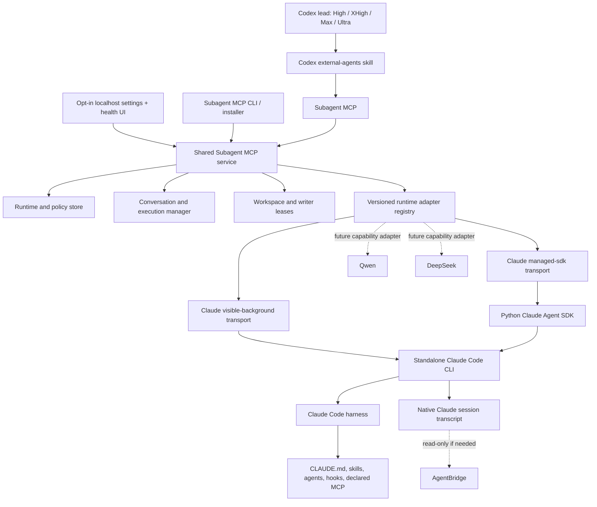
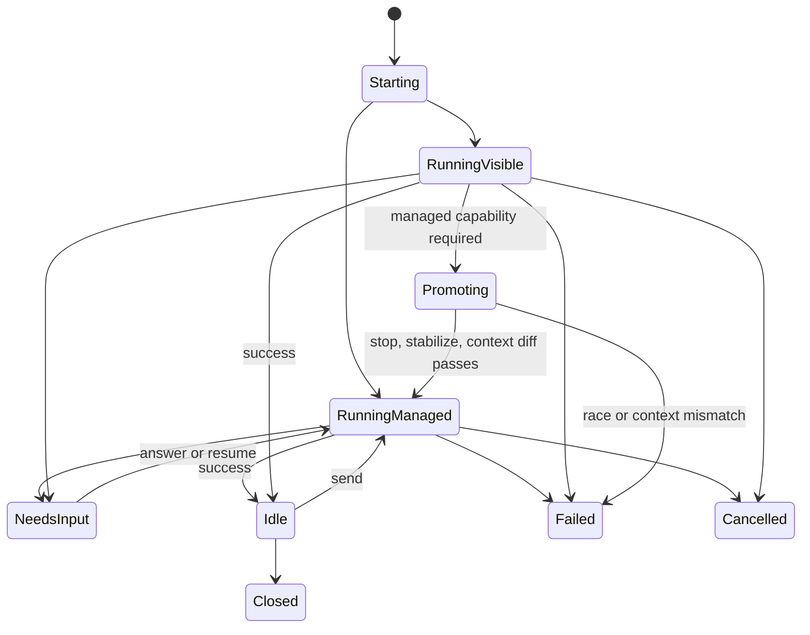

# Subagent MCP design

Status: 2026-08-20 design amendment reviewed; Phase 0a static hardening complete; the live-gates plan is reviewed and awaiting user approval; production implementation not started
Date: 2026-08-18; revised 2026-08-20
Release target: Windows, macOS, and Linux with local Codex and Claude Code installations

## 1. Purpose

Subagent MCP lets Codex act as the lead/orchestrator while delegating bounded work to external coding-agent harnesses that use their own authentication and quota. Phase 1 supports Claude Code. Later adapters may support Qwen, DeepSeek, Grok, or other harnesses without changing the Codex-facing lifecycle contract.

This is a standalone, MIT-licensed, public MCP project. AgentBridge remains a separate product for handoff, transcript reading, and session pumping. Subagent MCP ships one shared control plane used by its stdio MCP server, CLI, and opt-in localhost settings UI; none of those surfaces may fork provider lifecycle semantics.



## 2. Goals

- Let Codex spawn, inspect, wait for, steer, cancel, and close an external agent with semantics comparable to a native Codex subagent.
- Present every external agent through one normalized identity/status/lifecycle shape so provider-specific UI differences are limited to declared model, native harness, and honestly missing capabilities.
- Use the actual Claude Code harness, not a direct Anthropic client loop.
- Charge Claude work to the user's Claude subscription automation/Agent SDK allowance, not Codex quota.
- Preserve Claude Code features when allowed: system prompt, CLAUDE.md, skills, agents, hooks, plugins, MCP, native sessions, and resume.
- Let the user fix a model/reasoning choice or let Codex select within a user-declared envelope.
- Let the user enable or disable each runtime independently.
- Stop calling a runtime after a terminal quota signal until an approved recovery probe succeeds.
- Support Codex High, XHigh, Max, and Ultra. The MCP server does not gate by intelligence level.
- Support existing workspaces and worktrees created by either Codex/Subagent MCP or Claude Code.
- Survive ordinary CLI, SDK, and plugin updates without silent corruption or state loss.
- Keep a narrow, capability-based adapter seam for future harnesses.
- Publish versioned MCP and adapter schemas so adding a provider does not change the Codex-facing lifecycle.
- Install from PyPI/GitHub without a personal plugin, register through official client commands, and update through immutable staged runtimes with rollback.
- Provide a simple opt-in loopback UI for runtime/model/context/trust settings and health without introducing an always-on daemon or frontend build toolchain.
- Release-support Windows, macOS, and Linux only after each platform passes its own real install, lifecycle, update, rollback, and uninstall gates.

## 3. Non-goals

- Do not make an MCP-run external agent appear in Codex's native Subagents panel through undocumented app-server APIs.
- Do not modify, append, or delete pre-existing or user-owned Claude or Codex transcript files. A Phase 0 canary may ask the user for a separate exact approval to let the provider's official lifecycle command remove only a newly created Subagent MCP-owned disposable session/worktree; without that approval it is retained.
- Do not merge, force-push, or delete work as a cleanup side effect.
- Do not expose hidden thinking to Codex or persist it in Subagent MCP.
- Do not implement Qwen, DeepSeek, Grok, or another adapter in phase 1.
- Do not promise compatibility with unknown future breaking changes. Promise detection, fail-closed behavior, preserved state, and a tested rollback path.
- Do not treat a worktree, writer lease, permission policy, or hook as an OS security sandbox against another process running as the same local user.
- Do not make the localhost UI an agent chat/operator console in version 1; agent lifecycle remains MCP-owned.
- Do not bind the settings UI to a non-loopback interface or run it automatically at login/startup.
- Do not claim platform support from unit tests or CI alone.

## 4. Current-machine evidence and checkpoint

The current Windows checkpoint was re-read on 2026-08-20. These are local facts, not portable defaults:

- AgentBridge remains a separate product and Subagent MCP must not use its state as execution storage.
- The official standalone Claude Code executable exists at `%USERPROFILE%\.local\bin\claude.exe`, execute-validates as 2.1.224, and reports first-party `claude.ai` subscription authentication.
- `ANTHROPIC_API_KEY`, `ANTHROPIC_AUTH_TOKEN`, and `CLAUDE_CODE_OAUTH_TOKEN` were absent in the current observer environment. Absence is not proof that the future adapter rejects an override; that negative path remains a required test.
- Python 3.10.11 and uv are installed. Node and npm are absent. The official MCP Python SDK v2 requires Python 3.10+ and is the production MCP baseline; the Claude Agent SDK remains pinned only inside staged Subagent MCP runtimes.
- The Desktop-owned wrapper/cache is not a supported runtime dependency. Observer equality or absence does not prove wrapper rejection; identity, ownership, and lifecycle evidence must do so.
- The hardened Phase 0a spike is the only implementation. A fresh cache-disabled run passed 240 tests and deselected four explicitly marked real-Git worktree tests; no live worktree test was borrowed as evidence.
- Independent Claude Code and Sol-high reviews drove two repair rounds on the live-gates plan. The static plan has no remaining blocking review finding, but its approval-gated live evidence has not run. The current Phase 0a report is not an accepted gate artifact and Phase 0b remains blocked.
- No production MCP, SDK adapter, client registration, settings UI, or cross-platform installer exists yet.

Standalone installation/login and the already approved probes do not authorize any new dependency installation, client registration, live model call, worktree release, or host configuration mutation. Each such action retains its own explicit approval gate.

## 5. User decisions

| Decision | Selected behavior |
|---|---|
| Project structure | New Subagent MCP, separate from AgentBridge |
| Claude billing/auth | Standalone Claude CLI subscription login |
| Claude transports | Both visible-background and managed-sdk |
| Claude session mapping | One external Claude session per Codex task |
| Worktree ownership | Codex/Subagent MCP may create one, or use an existing one |
| Write authority | Codex may decide autonomously; Subagent MCP enforces declared policy and leases |
| Writer concurrency | One writer per canonical worktree/realpath |
| MCP restart behavior | Managed run may stop but must resume; visible run may survive under Claude's supervisor |
| Main-context detail | Native-subagent-like status and distilled result, not raw trace |
| Codex UI integration | Semantic parity through MCP; no private native-panel injection |
| External-agent presentation | One normalized descriptor/status contract; localhost/MCP Apps may show provider name and licensed adapter icon; official Codex native panel only through a future documented public capability |
| Codex levels | High, XHigh, Max, and Ultra can call external agents |
| Default context | Declared-native, defined below |
| Default auto-compaction requirement | Exact trigger target 274,000 decimal tokens per external-agent run; provider window/capacity and trigger percentage are separate fields |
| Repo trigger policy | Any local Git repository may trigger via user, AGENTS.md, or skill |
| Project MCP | Never auto-load repository `.mcp.json` servers |
| Project hooks | Path and content hash must be trusted before execution |
| Node | Not a core/MCP/UI/Claude-native prerequisite; require it only when the resolved context contains a trusted Node-dependent hook/plugin/command |
| Nested Claude agents | Four spawned and four concurrent per execution, depth one |
| Runtime caps | Two active per runtime, four global, six starts/hour/runtime |
| MCP tool approvals | Runs automatic; config/trust/live-canary/worktree-release prompt |
| Public architecture | One Python package and one shared service behind MCP, CLI, and UI |
| Adapter extension | Versioned Python entry points plus capability manifests |
| Distribution | PyPI wheel/sdist plus GitHub Releases |
| License | MIT |
| Settings UI | Opt-in `subagent-harness-mcp ui`; static assets; settings and health only |
| UI lifecycle | Loopback-only process; no daemon or auto-start |
| Release platforms | Windows, macOS, and Linux, each with independent real gates |
| Claude 1.0 transports | Both managed SDK and visible background must pass before 1.0 |

## 6. Authentication and quota source

Claude runs as the same local OS user through a separately installed native Claude Code CLI. The user signs in once with `claude auth login`. Subagent MCP calls `claude auth status` as a no-model preflight and never stores or copies credentials.

The standalone Claude Code CLI is a mandatory prerequisite for the version-1 `claude-code` runtime on every supported platform. Although the Claude Agent SDK package may bundle a native Claude Code binary, Subagent MCP does not use it as an implicit fallback: managed SDK and visible-background must share one execute-validated CLI identity, authentication/session store, capability canary, and update boundary. A future managed-only runtime variant may make a different explicit contract; it cannot silently alter this one.

The user does not need Claude Desktop open or an interactive Claude Code terminal running. Installation plus successful subscription login is sufficient; Subagent MCP starts the required CLI/SDK processes on demand. The one-time `claude auth login` flow may open a browser. Subagent MCP never automates account credentials, enables usage credits, or changes billing settings.

`runtime_check` distinguishes `not_installed`, `auth_required`, `needs_canary`, `ready`, and `incompatible`. When the CLI is missing it returns `INSTALL_REQUIRED`, the searched paths and platform, a current official installation-document link/copyable command, and `next_action=recheck`; it does not download or install. The CLI/UI may open the official installation page or copy the command, but version 1 never executes a Claude installer. When `claude auth status` exits unauthenticated it returns `AUTH_REQUIRED` with `claude auth login` guidance; an explicit CLI/UI action may launch that exact command only after confirmation and read-back verification.

The adapter must attest that no higher-precedence API-key environment variable unexpectedly overrides subscription OAuth. It records only the authentication method/source, never the credential.

As of the current Anthropic documentation, subscription-backed `claude -p` and Agent SDK usage draws from the subscription's Agent SDK/automation credit pool. This is external to Codex quota, but it may be separate from interactive Claude usage limits. Subagent MCP must not claim an exact remaining balance unless the provider supplies it.

## 7. Runtime policy and model/reasoning selection

Each runtime has a revisioned policy.

```json
{
  "runtime_id": "claude-code",
  "enabled": true,
  "selection_mode": "lead-selects",
  "variants": [
    {
      "id": "opus-deep",
      "model": "opus",
      "reasoning": {
        "effort": ["xhigh", "max"],
        "thinking": { "type": "adaptive", "display": "omitted" }
      }
    },
    {
      "id": "fable-review",
      "model": "fable",
      "reasoning": {
        "effort": ["high", "xhigh"],
        "thinking": { "type": "adaptive", "display": "omitted" }
      }
    }
  ]
}
```

`selection_mode` is:

- `fixed`: one exact variant is configured; run tools cannot override it.
- `lead-selects`: Codex must choose a declared `variant_id`; the server validates the exact model/reasoning combination again.

The common contract stores a provider-native `reasoning` object. A future adapter publishes its own supported schema/capabilities. Subagent MCP does not pretend all providers share Claude's effort ordering.

Requested model/effort and actual model/effort from initialization/hooks are both persisted. A silent downgrade or unexpected model is a policy error.

Provider-native model IDs are bounded opaque strings at the common adapter boundary: nonempty, free of control characters, and at most 256 UTF-8 bytes. The common `reasoning` object remains defined and validated by each adapter's versioned schema; the core neither coerces it to an effort scalar nor imposes cross-provider effort names. The core has no provider-name allowlist and passes the selected values through exactly; the adapter manifest and runtime policy decide which variants are selectable. Fallback remains disabled, and requested/effective mismatch fails closed. An official `model_not_found` result marks only that variant `CAPABILITY_MISSING`/`needs_canary`; it never silently selects another model or disables unrelated variants.

### 7.1 Public adapter contract and customization

The built-in Claude Code adapter uses the same public adapter contract as third-party packages. Installed adapter distributions advertise one factory through the `subagent_harness_mcp.adapters` Python entry-point group. Subagent MCP discovers entry points with the standard-library `importlib.metadata` API; it does not scan arbitrary directories or execute repository-provided adapter code.

Every adapter factory returns a manifest before it can be selected:

```text
adapter_api_version
runtime_id, provider_id, harness_id, and display_name
optional package-owned icon resource metadata and license provenance
adapter_version
supported_platforms
supported_transports
provider-native model/reasoning schema
semantic permission capabilities
session/resume/interrupt/needs-input/worktree capabilities
required external executables and version constraints
```

The adapter API is SemVer-versioned independently from the MCP tool schema. Version 1 exposes typed asynchronous operations for `probe`, `resolve_context`, `spawn`, `send`, `snapshot`, `interrupt`, `close`, and `open_session`. The shared service owns idempotency, persistence, policy, quotas, event cursors, workspace leases, and final redaction; adapters translate only between the common contract and their native harness.

Import, manifest, or canary failure quarantines only the affected adapter/version. Entry-point name conflicts fail closed and list both owning distributions. A third-party adapter may not register new core lifecycle tools, write Subagent MCP state directly, or bypass the shared permission/output boundary. A future out-of-process adapter transport may implement the same API version, but version 1 does not add a second plugin RPC protocol before a non-Python adapter proves it necessary.

Installing or updating a third-party adapter is an explicit code-installation action. Subagent MCP never obeys a repository/model request to fetch one. The installer resolves the adapter wheel and dependencies into a new immutable runtime profile, records distribution/version/hash provenance, runs import/manifest/conformance checks, and switches profiles only after approval and health success; it never mutates the active environment in place. Dependency conflicts fail staging rather than altering a working runtime. Adapter removal switches to a new profile and preserves prior staged profiles for rollback.

## 8. Context contract: declared-native

The default is named `declared-native`, not `native`, because some active surfaces are intentionally declared rather than inherited.

```text
user CLAUDE/settings/plugins/hooks/memory: inherit
project CLAUDE/rules/skills/agents: inherit
project/local executable config: require trusted path+content hash
MCP: strict, only context_policy.mcp_servers
codex and agent-bridge plugins/tools: disabled to prevent recursion
retention and auto-compaction: preserve effective values
nested agents: four per execution, depth one
```

The resolved context record contains:

- setting sources;
- CLAUDE.md/rule sources;
- skills, agents, and plugins;
- declared MCP servers;
- tool allow/deny rules;
- inherited and Subagent MCP hooks;
- auto-memory mode;
- effective auto-compaction window;
- requested/effective auto-compaction trigger percentage and trigger-token target;
- effective cleanup period;
- nested-agent cap and depth;
- additional directories;
- system-prompt preset and append;
- content hashes and attestation source.

The parent sends a bounded `TaskPacket`, not its raw transcript. The packet contains the role, task, acceptance criteria, canonical cwd/workspace choice, authority-file pointers and hashes, repository base/head, semantic permission policy, and requested context policy. `context_mode=scoped` is the default; a full-context mode must be requested explicitly and attested.

Context policy distinguishes four quantities: the provider model window, Subagent MCP's task/context budget, the provider's auto-compaction calculation window/capacity, and the actual auto-compaction trigger. It records `budget_tokens`; requested/effective `auto_compaction_window_tokens`; requested/effective `auto_compaction_trigger_percent`; requested/effective `auto_compaction_trigger_tokens`; and the evidence source for every effective value.

The user policy retains an exact requested `auto_compaction_trigger_tokens=274000` decimal tokens per run. It is not silently reinterpreted as a window. Claude Code 2.1.224 documents `--autocompact <tokens>` and `CLAUDE_CODE_AUTO_COMPACT_WINDOW` as the calculation window/capacity, while the trigger percentage is a separate control whose default is documented only approximately. Therefore `--autocompact 274000`, a per-process environment value, or a hook observing that value proves only request/propagation of a 274000 window; none alone attests an exact trigger at token 274000. The adapter may compute an effective trigger only when an official surface attests both the effective window and an exact effective percentage/formula. Approximate documentation cannot produce an exact attestation.

The UI/context policy shows the trigger target and provider window separately and may customize each only inside the selected adapter's declared range. If the selected adapter cannot honor and attest the exact requested trigger, the run fails closed as `CAPABILITY_MISSING`; it does not downgrade to a 274000 window. Subagent MCP changes no global Codex or Claude CLI configuration. Unknown effective fields stay `unknown`, and Subagent MCP never claims model-window or cross-provider context parity from a compaction flag, environment value, or task-packet size.

The Claude Code system prompt preset is always used for managed SDK runs. `--bare` is forbidden because it removes the requested harness features and does not use the selected subscription OAuth path.

### 8.1 Declared MCP

Every Claude run uses strict MCP configuration. `context_policy.mcp_servers` is explicit and revisioned. Subagent MCP never enumerates private `~/.claude.json` state and never parses `claude mcp list` output to construct policy. User- and plugin-provided MCP servers do not carry into an external run unless the user declares them in this policy; that loss of automatic inheritance is an intentional security trade-off.

The Codex and AgentBridge orchestration surfaces are excluded even if installed. Deny is defense in depth through both tool removal/`--disallowedTools` and permission deny rules. Post-initialization attestation detects drift; it is not the pre-spawn security boundary.

### 8.2 Project executable content

Because any local Git repository may trigger delegation, executable project content is separately gated:

- project/local command hooks require a trusted canonical path and SHA-256;
- external CLAUDE.md imports outside the repository require the same;
- project MCP is not inherited; an explicit declared MCP entry is required;
- a changed file invalidates its previous trust decision;
- config/trust mutations require a user approval prompt.

If an executable project item is not trusted, the run is rejected. Subagent MCP does not silently downgrade context.

The pre-spawn manifest is protected against time-of-check/time-of-use drift within the stated same-user threat boundary. On Windows, Subagent MCP opens each trusted project settings/import file for shared read but denies write/delete sharing. On POSIX, it opens without following symlinks where supported, records device/inode identity, takes a shared advisory lock, and treats the lock as protection only from cooperative writers. Every platform verifies canonical path, file identity, and hash before spawn and again at initialization acknowledgement; path replacement, identity change, or content drift aborts/quarantines the execution. Managed mode receives the acknowledgement from the SDK stream plus the bridge SessionStart hook. Visible-background receives it from the injected SessionStart hook's event file; there is no background output stream to wait on. A platform that cannot pass its real editor-save/atomic-replace race canary cannot release-support executable project content or the declared-native context policy.

Every handle/lock is released in a `finally` path for success, timeout, cancellation, hook failure, and process-start failure. A timeout aborts the start and releases all resources rather than leaving the user's editor unable to save a project config file. Hold duration and editor-save/atomic-replace behavior are measured separately per platform. Post-init attestation catches drift but is not the only execution gate.

### 8.3 Nested Claude agents

The cap resets for every Subagent MCP execution/turn:

- at most four total Agent spawns;
- at most four concurrently active;
- depth one only.

The count is enforced by the Subagent MCP `PreToolUse` policy helper, not by `CLAUDE_CODE_MAX_SUBAGENTS_PER_SESSION` (whose scope is the whole Claude session). The helper performs an atomic state transaction keyed by `(conversation_id, execution_id)`, rejects the fifth total or concurrent spawn, and increments the counters before allowing the Agent call. `SubagentStop` decrements the active count; execution finalization reconciles leaked active counters after interruption. Concurrent Agent calls serialize through the same transaction.

The depth rule is also enforced in `PreToolUse` for the `Agent` tool. A tool call with an existing `agent_id` originates inside a subagent and is denied. Tool hooks from subagents carry `agent_id`/`agent_type`, so the same workspace and command policy applies to nested work.

## 9. Claude transports

The transports are deliberately asymmetric.

| Capability | visible-background | managed-sdk |
|---|---:|---:|
| Appears/attaches in `claude agents` | Yes | No |
| Survives MCP/terminal update | Claude supervisor manages it | Current process stops; session resumes |
| Structured status | `agents --json` plus hook events | SDK messages |
| Structured final/error | Stop/StopFailure hook file | SDK result |
| Live steer/interrupt | No public headless reply; stop only | Yes |
| Dynamic policy gate | Deterministic command hook | SDK hook and callback |
| Hard per-run budget | No public background surface | Yes |
| Worktree | Claude background manager or existing | Codex/Subagent MCP or existing |
| Nested-agent text forwarding | No | When explicitly enabled |

No control decision parses TUI or `claude logs` text.

### 9.1 visible-background

This transport uses public Claude Code background surfaces: `--bg`, `agents --json --all`, `stop`, `respawn`, `attach`, and lifecycle hooks.

It is suitable for long one-shot tasks that benefit from Agent View visibility and do not require live Codex steering or a hard budget. The Claude supervisor owns the worker process and any worktree it creates.

Background attestation is a proxy, because `--bg` cannot combine with print/stream JSON. The adapter first attempts a no-model SDK initialization with the same context flags. If that does not expose enough data, it uses an approved minimal `-p --no-session-persistence` proxy and records that the proxy may differ from the daemon environment.

### 9.2 managed-sdk

This transport uses the pinned Python Claude Agent SDK, but its `cli_path` points to the execute-validated standalone Claude binary. It uses the Claude Code system prompt preset and explicit setting/MCP/tool policies.

It supports streaming input, follow-ups, interruption, policy callbacks, budgets, and structured results. The session does not appear in Agent View or the normal picker; Subagent MCP returns the exact `claude --resume <session-id>` command and may open a terminal only when explicitly asked.

Managed process ownership is capability-gated per platform. The public/default SDK transport is the compatibility baseline. Windows may enable a Job-Object transport only when the installed SDK's public Transport contract and exact SDK/CLI pair pass a live canary. POSIX may use a captured child handle plus a dedicated process group/session only after equivalent canaries. Unsupported ownership modes remain cooperative; Subagent MCP never guesses a PID or silently claims hard tree termination.

Cancellation first requests SDK interrupt and disconnect. With the Job-Object capability, Subagent MCP terminates the verified job only after a bounded grace period. The fallback default transport uses cooperative cancellation and may use a PID only when process identity and creation time were captured through a supported surface. If it cannot prove identity, it returns `RECOVERY_REQUIRED`, retains the lease, and never kills a guessed PID.

### 9.3 One-way promotion

A conversation may start visible and promote once to managed when Codex requires follow-up, steering, or a budget.

Promotion is:

1. stop the background job;
2. poll `agents --json --all` until the session has no live worker/PID;
3. repeat the check after a stabilization interval to catch daemon respawn races;
4. verify the saved workspace/session lease;
5. initialize managed mode against the same native session ID;
6. diff the resolved context and model policy;
7. continue only if the diff matches.

Version 1 never automatically moves a managed session back to background. The user may attach/resume and run `/bg` manually.

## 10. Codex routing at all intelligence levels

The MCP server has no Ultra-only check. The Codex plugin skill is available in High, XHigh, Max, and Ultra.

- Ultra may delegate proactively when valuable.
- High/XHigh/Max delegate when the user asks or an applicable project/skill instruction requests it.
- Any local Git repository may request delegation by the user's decision.
- Project instructions cannot change persistent policy, trust content, run a live canary, or release worktrees without the configured approval prompt.

Hard limits replace intelligence level as the resource guard:

- two active conversations per runtime;
- four active conversations globally;
- six starts per hour per runtime;
- one writer per canonical workspace path;
- four depth-one nested agents per execution.

## 11. MCP tools

| Tool | Approval | Purpose |
|---|---|---|
| `runtime_list` | automatic read | Runtime capabilities, health, policy, circuit state |
| `runtime_check` | automatic read | No-model compatibility/auth checks |
| `runtime_configure` | prompt | Revisioned enable/disable/model/context/cap patches |
| `runtime_canary` | prompt | Live model/harness canary that consumes external quota |
| `project_scan` | automatic read | Project executable-content manifest and hashes |
| `project_trust` | prompt | Trust/revoke exact path+hash |
| `agent_spawn` | automatic run | Create a conversation and its first execution |
| `agent_status` | automatic read | Active/Done/Needs-input and evidence |
| `agent_send` | automatic run | Follow-up, queue/interrupt, or one-way promote |
| `agent_wait` | automatic read | Bounded wait for one to eight targets |
| `agent_interrupt` | automatic run | Interrupt/cancel the current execution through the native harness contract |
| `agent_close` | automatic run | Close logical conversation and leases; never delete transcript/worktree |
| `workspace_release` | prompt | Safely release a Subagent MCP-owned worktree |

`runtime_check` and `runtime_canary` are separate so approval cannot depend on a hidden boolean argument.

### 11.1 agent_spawn

Input:

```text
request_id
api_version
runtime_id
task.title
task.prompt
task.acceptance_criteria[]
task.role
task.authority[]
task.repository_base/head
cwd
mode: review | plan | test | implement
variant_id
transport: auto | visible-background | managed-sdk
required_capabilities[]
context_policy_id
permission_policy_id
workspace: current | existing(path) | create(base_ref,name)
```

Output:

```text
conversation_id
execution_id
external_session_id
background_job_id?
workspace_id/path
resolved model/reasoning/transport/context hash
requested/observed attestation and evidence sources
status and state_revision
resume/open command
```

`request_id` is a required idempotency key. A unique database constraint prevents duplicate external work when an MCP call is retried.

### 11.2 agent_send

`agent_send` creates a new `execution_id` while retaining the conversation and external session. It accepts a new idempotency key and supports:

- normal follow-up;
- managed queue or interrupt;
- structured `reply_to` and `answers` for AskUserQuestion;
- one-way promotion when a visible conversation needs managed capabilities.

### 11.3 agent_wait and output

`agent_wait` accepts one to eight targets, a state cursor/revision, and a bounded timeout. The eight-target batch may include idle, completed, failed, and cross-runtime conversations; it does not raise the four-active global concurrency cap. It wakes on completion, needs-input, failure, or cancellation and includes the latest compact status for every target.

Model-critical MCP results are text-only Markdown followed by a fenced `subagent-mcp-meta` JSON block. This avoids known client behavior that can drop textual content when both text and structured content are present. Raw diagnostics stay in bounded artifact files.

External results are marked with provenance and treated as advice/data. Codex remains responsible for independent verification.

### 11.4 Semantic permissions and normalized events

Public requests use semantic permissions rather than native command strings:

```text
repo_read | git_read | run_tests | workspace_write | network |
nested_agents | browser | declared_mcp
```

Each capability has versioned preconditions and observable evidence. The adapter translates it into native tools, sandbox/permission rules, hooks, and exact argv allowlists, then performs a no-model preflight. If the translation blocks an operation that the declared capability promised—such as a cache-disabled test command—the execution fails as `CAPABILITY_MISSING`/adapter evidence, not as model behavior. Repository text can never widen the policy.

All adapters emit the same redacted event vocabulary with monotonically increasing execution-local cursors:

```text
started | checkpoint | tool_started | tool_finished |
permission_denied | needs_input | quota_paused |
completed | failed | interrupted | cancelled
```

Provider events may be referenced from bounded artifacts, but hidden thinking is discarded before event normalization and is never written. Text/tool values pass a key-aware secret/PII redactor and size cap. A provider's assistant-final and result envelope are deduplicated into one terminal event. `agent_status` and `agent_wait` expose the same compact event/status shape regardless of adapter.

### 11.5 External-agent presentation parity

Every lifecycle response includes one provider-neutral presentation descriptor:

```text
conversation_id and execution_id
runtime_id, provider_id, harness_id
display_name and model_display_name
normalized status and state_revision
transport and declared capability gaps
icon: package_resource + media_type + SHA-256 + license, or generated monogram fallback
ui_surfaces: localhost_activity | mcp_app | native_host_panel
```

The built-in Claude adapter defaults to `display_name="Claude sub-agent"`. An adapter icon must be a package-owned static resource with explicit redistribution/license provenance; arbitrary remote URLs, user filesystem paths, and unlicensed provider trademarks are rejected. When no redistributable icon is available, clients generate a neutral monogram. This presentation metadata never changes lifecycle, permissions, quota, or session ownership.

`agent_spawn`, `agent_status`, `agent_wait`, `agent_interrupt`, and `agent_close` use the same request/state/event contract for Claude and future adapters. A provider capability that truly does not exist—such as live steering in visible-background mode—is returned as an explicit capability gap, not hidden behind a different workflow or simulated by private APIs.

As of 2026-08-20, MCP cannot register an external Claude session as a native row in Codex Desktop's Subagents panel or set that row's icon through a documented public extension field. Version 1 therefore reports `native_host_panel=unsupported`; it never writes Codex private app-server/session/UI state. The localhost activity view and an optional MCP Apps component may render the same descriptor. If a future Codex release exposes a documented public native-panel registration capability, a versioned optional client integration may advertise `native_host_panel=supported` after a real canary without changing the common MCP lifecycle contract.

## 12. State machines

Runtime states:

```text
disabled | not_installed | auth_required | probing | needs_canary | ready |
degraded | incompatible | auto_paused | unhealthy | quarantined
```

Conversation states:

```text
open | active | needs_input | idle | promoting | closed
```

Execution states:

```text
queued | starting | running | needs_input | succeeded |
failed | cancelled | interrupted
```



A terminal quota event changes the execution and runtime circuit in one transaction.

## 13. Workspace and writer ownership

Workspace strategies:

- `current`: use the requested checkout;
- `existing`: validate an existing linked worktree;
- `create`: Subagent MCP creates and owns a worktree from an explicit base ref/name;
- visible background may let Claude create its own worktree after a provisional repository creation lease is acquired.

Subagent MCP records repository common-dir, origin path, canonical worktree path, base commit, branch, creator, and active leases.

One active writer is allowed per canonical workspace identity. Windows keys the resolved path with volume/file identity and case-insensitive normalization; POSIX keys resolved path plus device/inode identity. Read-only executions may run concurrently within the global/runtime caps.

For a visible-background run whose final worktree path does not exist at spawn time, Subagent MCP first takes a short-lived provisional creation lease on the repository common-dir. Configuring Claude's `WorktreeCreate` hook replaces Claude Code's default Git worktree creation; it is not a notification hook. Its input supplies a worktree `name`, not a completed path, and a command hook must create the worktree and print the resulting path as its last non-empty stdout line.

Subagent MCP therefore installs a dedicated, staged `WorktreeCreate` handler rather than the generic event sink. The handler receives the expected repository, approved worktree root, execution ID, and state location as fixed argv fields. It validates the input name and canonical repository identity, creates only a new worktree below the approved root, re-verifies the Git common-dir, and atomically converts the provisional repository lease into the permanent canonical-path writer lease. Only after that transaction commits does it append the structured acknowledgement and print the path to Claude Code. Claude cannot begin work in the path before the permanent lease exists.

If creation, identity validation, lease conversion, or acknowledgement fails before hand-off, the handler exits nonzero and removes only the clean worktree it just created. A cleanup failure leaves the path recorded as `RECOVERY_REQUIRED`; it is never hidden by printing a usable path. The parent startup timeout releases an unconverted provisional lease. Repository-level serialization covers only this creation/lease transaction, not the whole execution. `WorktreeRemove` is different: its input includes `worktree_path`, so the generic event sink may record it while Claude Code retains its documented Git cleanup lifecycle.

`agent_close` refuses while an execution is still active and never deletes. `workspace_release` only removes a Subagent MCP-owned worktree when:

- no live session or lease uses it;
- it is clean;
- it has no unpushed commits;
- repository/common-dir identities still match.

Claude-supervisor-owned worktrees are never cleaned by Subagent MCP automatically. Merge and push are task-policy decisions, not cleanup.

## 14. Persistence and ownership

Subagent MCP uses OS-native config/state/data locations. Windows uses `%APPDATA%\SubagentMCP` for config and `%LOCALAPPDATA%\SubagentMCP` for state/data; macOS uses `~/Library/Application Support/SubagentMCP`; Linux honors `XDG_CONFIG_HOME`, `XDG_STATE_HOME`, and `XDG_DATA_HOME` with their standard fallbacks. `SUBAGENT_MCP_HOME` is the only supported override and collapses all roots into explicit `config/`, `state/`, and `data/` children for portable installs and tests.

```text
<config>/config.json
<state>/state.db
<state>/events/<execution>.jsonl
<state>/artifacts/<execution>/
<state>/logs/
<data>/runtimes/<version>/
<data>/current.json
<data>/bin/<stable-platform-launcher>
<data>/ownership.jsonl
```

The SQLite database uses WAL mode and stores runtime policy/circuit state, conversations, executions, idempotency keys, leases, trust hashes, attestations, and final summaries.

It never stores credentials, thinking, raw system prompts, or unredacted tool output. Events are append-only and redacted. Operational logs rotate. Conversation metadata/final summaries do not auto-purge in version 1.

Config updates validate, stage, fsync, atomically replace, and increment a revision. Database migrations are additive-only; destructive schema changes require expand/contract over at least two releases.

Native Claude transcripts are owned and written only by Claude Code. Subagent MCP never directly edits them; the only removal exception is the separately approved provider-native deletion of a Subagent MCP-created disposable Phase 0 canary described in section 3. AgentBridge state is untouched.

### 14.1 Opt-in localhost settings UI

`subagent-harness-mcp ui` starts a temporary loopback-only HTTP server on an OS-assigned port and opens the default browser. It serves package-owned static HTML/CSS/JavaScript and calls the same `SubagentMcpService` used by MCP and CLI; the HTTP layer contains no duplicate policy or persistence logic. It requires no Node runtime or frontend build step.

Version 1 exposes runtime enablement, executable discovery, variants, context and semantic-permission policies, project trust, health/capability results, update state, and quota-circuit state. It also exposes a read-only current/recent external-agent activity list using the section 11.5 descriptor; this is status visibility, not a chat/operator console. The context settings show separate editable `auto_compaction_trigger_tokens` and provider `auto_compaction_window_tokens` fields with the selected adapter's declared ranges; the default trigger target is `274000`, and values outside the ranges are rejected. Unsupported exact-trigger policies are visibly unavailable rather than translated to a provider window. It does not expose agent prompts, transcripts, send/interrupt/close controls, raw events, or arbitrary file browsing.

For `claude-code`, the health page presents explicit onboarding states: missing CLI with official per-platform install guidance and Re-check; installed but logged out with `claude auth login` guidance; incompatible/changed CLI with canary requirements; or ready with only version/auth-method/provider metadata. It never displays account email, organization identifiers, credential material, or private usage-history data.

The server listens only on explicit loopback addresses, rejects non-loopback peers and unexpected `Host`/`Origin` headers, sends no CORS allowlist, uses a per-process cryptographically random bootstrap token plus CSRF token, sets a restrictive CSP, and never persists the browser token. The bootstrap secret is carried in the initial URL fragment rather than query/path, exchanged once through `X-Subagent-MCP-Token` for a `Secure`-when-applicable, `HttpOnly`, `SameSite=Strict` session cookie, removed from browser history, and never placed in logs or referrers. It fails rather than fall back to a public interface. Closing the process stops the UI; there is no service, tray application, startup entry, telemetry, or remote-access mode in version 1.

## 15. Quota circuit breaker

Runtime circuit states distinguish disabled, auth-required, transient failure, and quota pause.

- terminal `rate_limit` or `billing_error` opens `auto_paused`;
- `authentication_failed` becomes `auth_required`;
- `model_not_found` invalidates only the affected variant when alternatives remain;
- `overloaded` and `server_error` use the harness's bounded retry path and do not permanently pause the runtime;
- status/cancel/close remain available while paused;
- spawn/send are blocked;
- `retry_after` is stored only when supplied by the provider;
- after `retry_after`, the circuit becomes half-open and requires an approved live canary;
- exact remaining quota/reset time is reported as unknown unless provided.

The mere presence of a Claude Code `rate_limit_event` is not a terminal signal. Subagent MCP parses only structured top-level `system/init`, `rate_limit_event`, and `result` envelopes without parsing assistant/thinking blocks, and it does not assume JSON key order. A plan status of `allowed` or `allowed_warning` followed by `result.is_error=false` is a successful turn. In particular, `overageStatus=rejected` with `overageDisabledReason=out_of_credits` and `isUsingOverage=false` is informational when usage credits are disabled; it must not pause plan-backed execution. A terminal quota transition requires a final structured error (`result.is_error=true`) or a `StopFailure` whose normalized category is `rate_limit`/`billing_error`. Exit code zero, result subtype `success`, or a rate-limit envelope alone is insufficient in either direction. Subagent MCP never enables usage credits or changes billing settings.

Background StopFailure hooks provide structured error categories. Future adapters normalize equivalent provider signals into the same runtime circuit semantics.

As of 2026-08-20, the official Claude Code StopFailure hook categories are `rate_limit`, `authentication_failed`, `oauth_org_not_allowed`, `billing_error`, `invalid_request`, `server_error`, `max_output_tokens`, and `unknown`. `model_not_found` is documented on the managed SDK assistant-error surface, not as a StopFailure hook category; `overloaded` is a retry/runtime condition, not a documented StopFailure matcher. The common runtime circuit may still normalize those conditions when their own official transport surfaces report them, but the background hook adapter must not invent them. It fixture-tests the installed binary, preserves unknown future values, and maps an unrecognized hook value to `unknown` rather than crashing or silently treating it as success.

Quota signals are account/provider scoped, not proof that Subagent MCP caused the exhaustion. Manual Claude Code sessions, Agent View, IDE/Desktop sessions, or another local consumer may open the circuit. Subagent MCP reports its own starts separately from the observed provider signal and never attributes account usage to itself without evidence. It does not parse private files such as `plan-usage-history.json`; an official usage surface may be added later as an adapter capability.

## 16. Errors and needs-input

Every failure returns:

```text
code
category
retryable
runtime/conversation/execution state
human message
evidence references
next action
state revision
```

Stable error codes:

```text
AUTH_REQUIRED
INSTALL_REQUIRED
RUNTIME_DISABLED
QUOTA_PAUSED
POLICY_REJECTED
CONTEXT_DRIFT
PROJECT_CONTENT_UNTRUSTED
CAPABILITY_MISSING
TRANSPORT_INCOMPATIBLE
WORKSPACE_BUSY
SESSION_BUSY
HOOK_FAILED
CANCEL_TIMEOUT
UPDATE_QUARANTINED
RECOVERY_REQUIRED
```

Managed AskUserQuestion is returned as structured needs-input. Background needs-input requires user attach or promotion; Subagent MCP never controls a TUI or daemon private pipe.

Cancellation is successful only after the process/supervisor state is observed stopped. A timeout retains the lease and returns `RECOVERY_REQUIRED`.

## 17. Security boundary

- Local Git repositories may request delegation by explicit user decision.
- Persistent config, trust, live canaries, and workspace release always require approval.
- Project executable content is hash-gated.
- MCP is strict and declared before spawn.
- Self-recursive orchestration plugins/tools are disabled and denied.
- Commands are spawned as argv arrays without shell string interpolation.
- Subagent MCP hooks use the staged Python runtime at an absolute, hashed path.
- Outputs are redacted and framed as untrusted data/advice.
- Hidden thinking is never transferred.
- A native local harness has no guaranteed OS sandbox. Permissions, hooks, leases, and worktrees are guardrails, not containment against malicious same-user code.
- Codex must independently inspect diffs and run relevant tests before merge.

## 18. Update and rollback

The testable guarantee is: an update cannot silently corrupt/duplicate work, lose a session, or change model/context outside policy.

- Standalone CLI candidates are execute-validated. Desktop cache binaries and version-folder wrappers are rejected.
- Every spawn records executable realpath, file identity, SHA-256, and version.
- A changed CLI/SDK/adapter enters `needs_canary` and blocks new work.
- No-model checks run first: auth, command/capability probes, context resolution, SDK import, background schema, and launcher handshake.
- A live canary consumes external quota and therefore always prompts.
- Managed compatibility is keyed by adapter version, pinned SDK version, CLI version, and observed capabilities.
- Background may remain usable if its own contract passes while managed is quarantined; routing never hides the downgrade.
- Subagent MCP versions are immutable staged runtimes selected by an atomic pointer.
- A failed health window rolls the pointer back to the prior staged runtime.
- Running MCP processes keep their old runtime; new sessions use the new one.
- Claude CLI downgrade/install is never automatic. Subagent MCP may print the official recovery command after approval is requested.

The production deliverable is an MIT-licensed standalone open-source MCP server package with a standard stdio entry point and versioned public tool schemas. It uses the stable official MCP Python SDK v2 line with an explicit compatible upper bound. It must work with any compliant MCP client and must not require a personal Codex plugin, personal marketplace entry, machine-specific path, or private account state. Claude Code, future DeepSeek/Qwen harnesses, and other providers are adapters behind the same public MCP contract. A public optional client bundle may provide routing prompts or skills, but it cannot own execution state and is never required for the MCP server to function.

Subagent MCP never patches, replaces, or vendors the user's Codex/Claude executables, wrappers, caches, plugins, global settings, or transcripts. It execute-validates an explicitly configured/discovered harness binary and supplies only per-run argv/settings inside Subagent MCP-owned state.

Distribution publishes reproducible wheel/sdist artifacts to PyPI and matching GitHub Releases with a machine-readable manifest and SHA-256 checksums. The documented bootstrap paths are `uv tool install` and `pipx`; release automation builds and tests both artifacts before publication. Normal execution never downloads code.

Installation, update, and MCP registration are separate explicit commands with `--dry-run`. Registration uses the client's official lifecycle command and reads the result back; generic clients receive a versioned snippet/instructions. Direct configuration-file mutation is forbidden. An append-only ownership journal records every launcher, staged runtime, and client registration with its canonical identity. Uninstall removes only still-matching owned resources and keeps state, native sessions, and worktrees by default.

All client registrations point to one stable platform launcher, never directly to a package-manager shim or versioned environment. Windows uses `powershell.exe -NoProfile -NonInteractive -ExecutionPolicy Bypass -File <absolute-launcher>` with a UTF-8 BOM launcher. macOS/Linux use a POSIX launcher with equivalent argv-array/no-eval behavior. The launcher reads an atomic `current.json` pointer to an immutable staged runtime. Update stages and verifies the candidate, runs migrations in expand-compatible mode plus health/canary gates, then switches the pointer atomically. A failed health window rolls back. Launcher updates themselves use stage/fsync/atomic replace and retain the previous copy.

Windows, macOS, and Linux are independently release-supported. Each platform requires a clean-machine install, client registration, MCP restart, update, rollback, and uninstall-preserves-data run using that platform's actual launcher and filesystem/process semantics. A green cross-platform unit-test matrix is necessary but never sufficient evidence.

The public repository includes `README.md`, `LICENSE` (MIT), `SECURITY.md`, `CONTRIBUTING.md`, `CODE_OF_CONDUCT.md`, changelog, architecture/spec links, versioned JSON schemas, adapter-author guide, threat model, release provenance/checksums, and a minimal conformance adapter. No generated artifact contains local account identity or machine-specific probe data.

## 19. Phase 0 spike gates

Phase 0 is split so host facts are learned before production adapters are designed around assumptions.

### 19.1 Phase 0a: host/CLI probes, no production adapter

Phase 0a begins after explicit approval to install the standalone Claude CLI and complete subscription login. Node is not on this critical path.

1. Run exact auth precedence checks and reject API-key override.
2. Record the standalone executable identity/version and demonstrate that the Desktop-owned wrapper is rejected because of ownership, cross-harness visibility, and swap/cleanup lifecycle races—not because it must be broken at probe time.
3. Probe the documented CLI/background lifecycle commands and capture `agents --json --all` rows for working, needs-input, done, failed, and stopped.
4. Prove strict declared MCP excludes project and recursive servers before spawn.
5. Probe project hook/import manifests and measure the bounded Windows file-handle stability window, including editor save contention and cleanup on every error branch.
6. Prove `WorktreeCreate`/`WorktreeRemove` hook delivery on the installed CLI, including visible-background path reporting before the provisional repository lease is converted to a permanent path lease. Missing or late delivery blocks auto-worktree mode.
7. Prove Stop/StopFailure hooks write structured event files in background mode and record unknown error values safely.
8. Probe daemon stop/respawn races on Windows PowerShell 5.1.
9. Measure Agent View model-summary overhead and observed background concurrency limits.
10. Attest the CLI-visible declared-native context and measure its context/token cost with the smallest approved live probe.

Node is not a Subagent MCP or native Claude Code prerequisite. If a selected declared-native context contains a trusted Node-dependent hook/plugin/command, that dependency must be detected and either separately installed with approval or the affected context policy remains `CAPABILITY_MISSING`; no silent context downgrade is allowed.

### 19.1.1 Mandatory Phase 0a correction gate

The 2026-08-18 independent reviews reject the current report as an acceptance artifact. Before any Phase 0b dependency install or adapter prototype, a correction plan must implement and prove all of the following:

1. Parse only bounded top-level `system/init`, `rate_limit_event`, and `result` envelopes without assuming key order or parsing assistant/thinking payloads. Required booleans and collection/object types fail closed; missing `result.is_error` cannot become success. Preserve provider error codes and unknown fields needed for future classification.
2. Bind executable-content trust to canonical path, SHA-256, repository identity, and trust revision. Same-content files at different paths do not share trust. The manifest covers every project/local executable source the declared context can load, including transitive external instruction imports.
3. Remove content-heavy hook fields from durable lifecycle events unless a normalized contract explicitly needs them. Normalize auth/roster before persistence, add key-aware credential/PII redaction, cap excerpts, and keep local raw evidence out of shareable/committed artifacts.
4. Make WorktreeCreate creation, lease acknowledgement, event acknowledgement, and stdout hand-off one recoverable transaction. Reconcile partial `git worktree add` outcomes. Cleanup failure retains/atomically writes durable `RECOVERY_REQUIRED` state; acknowledgement is removed only after verified cleanup. Test rollback failure, partial creation, stdin truncation, and stdout failure.
5. Record standalone executable canonical identity, file identity, SHA-256, and version. Reclassify observer equality/absence as insufficient evidence and prove Desktop-wrapper rejection from ownership and lifecycle behavior rather than a cache visibility artifact.
6. Split the observed init subset from full declared-native context. Mark the full gate BLOCKED until every section 8 field is attested, record the managed-proxy versus background caveat, and require a positive control for per-run plugin disable.
7. Replay every committed fixture in tests and include observed CLI/harness version plus provenance. Regenerate stale model/concurrency/lifecycle summaries from retained sources without copying account identifiers. Machine-local evidence must have a shareable sanitized derivative or the report must label it local-only.
8. Make the report generator require exactly the declared gate set, reject PASS without evidence, and preserve generated versus reviewed narrative deterministically. Re-running the documented command must not destroy hand-written decisions.
9. Rerun cache-disabled tests. Real worktree tests and any live Claude probe retain separate explicit approval. Re-review the corrected tree independently through Codex and a different model/harness before accepting the report.

### 19.2 Phase 0b: disposable adapter prototypes

Phase 0b may write isolated spike code, but not production registration or host configuration.

1. Pin/import the Python SDK and prove `cli_path`, system-prompt preset, effort, thinking, strict MCP, setting sources, hooks, and cooperative process cleanup.
2. Capability-test the optional Job-Object transport against the default SDK transport and exact SDK/CLI pair.
3. Prove managed AskUserQuestion/resume and multiple executions on one external session.
4. Prove visible-to-managed promotion preserves session, workspace, model, and context and has no concurrent writer.
5. Prove per-execution nested-agent counters, depth one, and subagent worktree escape handling.
6. Exercise auth/quota/overload/model-not-found fixtures and circuit transitions.
7. Simulate CLI/SDK/Subagent MCP updates, MCP restarts, locked files, PID reuse, and pointer rollback.

#### 2026-08-21 Windows Managed Preview build-lane amendment

The current Phase 0a report remains honestly `BLOCKED`: the final managed Group B
probe initialized but did not produce a terminal result or exact no-overage
attestation. That result blocks provider-live readiness claims, not deterministic
construction of the shared product. To shorten time to a usable public preview,
the common core, SQLite/config state, deterministic fake adapter, stdio MCP,
capability-gated Claude adapter, localhost UI, packaging, and temporary-root
install/update/rollback simulations may proceed under the committed Windows
Managed Preview plan.

This amendment does not turn unknown evidence into PASS. Before its exact live
canary, the Claude managed adapter reports `needs_canary` and cannot launch; the
only exception is the separately approved/bound `runtime_canary` bootstrap after
no-model identity/auth/credential/no-overage preflight. Ordinary `agent_spawn`
and `agent_send` remain blocked until that canary terminally attests
`isUsingOverage=false`, exact model/session/context, and cleanup for the exact
adapter pair. The visible-background/promotion modes remain unavailable. Publication may include
those explicit gaps, but it may claim Claude-ready or Windows release support only
after the installed-artifact real gates pass. Usage credits remain forbidden,
model IDs remain opaque and exact with no fallback, and existing Codex/Claude/
AgentBridge state remains outside the product's write set.

### 19.3 Phase 1a: common core, MCP, and Claude adapter

After Phase 0b is accepted:

1. Implement versioned domain/request/event/error schemas and semantic permission policies.
2. Implement SQLite state, idempotency, circuits, trust, redaction, workspace leases, and revisioned config behind one shared service.
3. Implement the official MCP Python SDK v2 stdio server as a thin service adapter.
4. Implement the versioned Python adapter entry-point loader and conformance suite.
5. Move both accepted Claude transports behind the common adapter contract without changing their native harness/session behavior.
6. Prove spawn/status/send/wait/interrupt/close parity, final deduplication, needs-input, quota pause, and MCP restart recovery against a deterministic fake harness before live calls.

### 19.4 Phase 1b: public distribution, UI, and platform gates

1. Add CLI, PyPI/GitHub packaging metadata, MIT license, public documentation, security policy, schemas, and sample adapter.
2. Implement stable launchers, ownership journal, official client registration, staged update, rollback, and conservative uninstall.
3. Implement the opt-in static settings/health UI through the shared service and its loopback security contract.
4. Render the normalized read-only external-agent activity descriptor in that UI and, where the client supports MCP Apps, in an optional package-owned component; keep official Codex native-panel integration capability-gated and unsupported unless a public API exists.
5. Run clean-machine Windows, macOS, and Linux install/update/rollback/uninstall matrices.
6. Run a fresh registered Codex-to-MCP-to-Claude read-only review and write-capable worktree task, then independently verify the result.
7. Run a release-candidate review through at least two different model/harness families. Findings are data until verified against the repository.

Fresh real Codex High, XHigh, Max, and Ultra delegation is a release acceptance test in section 20, not a Phase 0 probe.

If a required phase-0 gate fails, the affected capability is removed from version 1 or the release is blocked. It is not left as a documented aspiration.

## 20. Acceptance criteria

Release requires all of the following:

- Every external executable required by the selected declared-native context (including Node only when a trusted hook/plugin/command needs it) passes its fidelity canary, or that context policy remains unavailable; the core MCP/UI never requires Node.
- Both selected Claude transports pass their declared contracts.
- Promotion preserves one native external session and an identical resolved context.
- Model/reasoning policy rejects every out-of-envelope request and attests actual selection.
- Scoped task packets, context budgets, compaction requests, and effective/unknown attestations are distinguished; no run claims a model-window value from a compaction flag.
- A real external-agent run requests and attests an effective `auto_compaction_trigger_tokens` value of exactly `274000`, separately records provider compaction window/capacity and trigger percentage, proves all are per-run and separate from the model context window and task/context budget, and proves no global Codex or Claude CLI configuration is mutated. A 274000 window request or propagated environment value is not accepted as a 274000 trigger; unsupported or unattested required values fail closed as `CAPABILITY_MISSING`.
- Semantic permission conformance proves equivalent promised capabilities across the native Codex comparison and Claude adapter; translation failures are surfaced as adapter failures.
- Claude and every conformance adapter return the same normalized presentation/status/lifecycle schema; provider-specific differences are limited to declared model/harness metadata and explicit capability gaps. The localhost activity view renders it, and native Codex panel support is never claimed without a documented public API plus a real canary.
- Disabled/paused runtimes never spawn.
- A clean host with no Claude Code CLI returns `INSTALL_REQUIRED` with current official guidance and no filesystem/config/process mutation; installed-but-logged-out returns `AUTH_REQUIRED`; neither path falls back to the SDK-bundled binary.
- After standalone install and `claude auth login`, Claude Desktop and an interactive Claude terminal may remain closed while both transports complete their real canaries through the same attested CLI identity.
- Quota exhaustion blocks subsequent calls until approved recovery.
- High, XHigh, Max, and Ultra real Codex sessions can delegate when requested.
- A fresh Codex session completes at least one bounded real task through the registered `claude-code` MCP; evidence must attest the Claude Code harness and external session, and a direct shell invocation is not a substitute.
- A read-only independent review succeeds through Claude subscription auth.
- A write-capable implementation succeeds in a worktree and Codex verifies its diff/tests independently.
- Claude Agent View or exact resume command opens the intended conversation without Subagent MCP metadata injected into chat content.
- One writer per worktree is enforced, including nested-agent attempts.
- Project MCP/hooks/imports cannot execute before their gate.
- MCP restart and update tests create no duplicate/corrupt/lost session.
- Stable launcher update and rollback pass on the real machine.
- PyPI wheel/sdist and GitHub Release artifacts install from a clean environment, carry matching version/checksum provenance, and expose the documented CLI/MCP entry points.
- Windows, macOS, and Linux each pass clean install, official/generic client registration, MCP restart, staged update, rollback, and uninstall-preserves-data evidence before being labeled supported.
- `subagent-harness-mcp ui` binds only to loopback, passes hostile Host/Origin/CSRF tests, edits revisioned settings through the shared service, reflects health/circuit state, and leaves no daemon/token after exit.
- A separately packaged sample adapter discovered through `subagent_harness_mcp.adapters` passes the public conformance suite without importing Subagent MCP private modules or registering alternate lifecycle tools.
- Public docs include installation, update/rollback/uninstall, common schemas, adapter authoring, customization examples, threat model, security reporting, and exact support boundaries.
- Committed/release artifacts and model-facing summaries pass credential/PII scans; raw local probe identifiers never appear in the public repository or release bundle.
- AgentBridge v0.3.8 remains operational and its existing transcripts/state are unchanged.
- No completion claim is based only on static inspection, config output, or a plan.

## 21. Authoritative references

- OpenAI Codex MCP: https://developers.openai.com/codex/mcp/
- OpenAI Codex subagents: https://developers.openai.com/codex/subagents/
- OpenAI MCP Apps UI: https://developers.openai.com/plugins/build/chatgpt-ui
- OpenAI Codex App Server: https://learn.chatgpt.com/docs/app-server
- Official MCP Python SDK v2: https://github.com/modelcontextprotocol/python-sdk
- PyPA entry-points specification: https://packaging.python.org/en/latest/specifications/entry-points/
- PyPA `pyproject.toml` specification: https://packaging.python.org/en/latest/specifications/pyproject-toml/
- Claude Code non-interactive mode: https://code.claude.com/docs/en/headless
- Claude Code CLI reference: https://code.claude.com/docs/en/cli-usage
- Claude Code Agent View/background sessions: https://code.claude.com/docs/en/agent-view
- Claude Agent SDK overview: https://code.claude.com/docs/en/agent-sdk/overview
- Claude Agent SDK sessions: https://code.claude.com/docs/en/agent-sdk/sessions
- Claude Agent SDK Python reference: https://code.claude.com/docs/en/agent-sdk/python
- Claude Code hooks: https://code.claude.com/docs/en/hooks
- Claude Code authentication: https://code.claude.com/docs/en/authentication
- Claude Code settings: https://code.claude.com/docs/en/settings
- Claude Code sessions: https://code.claude.com/docs/en/sessions
- Claude Code installation: https://code.claude.com/docs/en/installation
- Claude Agent SDK hosting/runtime requirements: https://code.claude.com/docs/en/agent-sdk/hosting

## 22. Implementation entry protocol

Implementation must not begin from the full brainstorming transcript.

1. Commit this design spec and let the user review it.
2. After design approval, write and commit a separate implementation plan with small checkpoints, exact file ownership, commands, rollback points, and phase-0 kill criteria.
3. Self-review the plan and let the user approve it.
4. Before executing the plan, compact the active context or start a fresh implementation session.
5. The compact/fresh session loads only the committed design spec, committed implementation plan, current repository state, applicable AGENTS.md files, and the exact current checkpoint.
6. It must not treat brainstorming recollections, external reviews, or old tool output as authority when they differ from those committed files or current live evidence.
7. Run Phase 0 first. Do not scaffold production modules, register MCP, install dependencies, or mutate host configuration until the relevant phase-0 gate and approval have passed.
8. At every checkpoint, record verified facts, partial results, blocked conditions, and the next exact action before context is compacted again.

This protocol is a release requirement, not optional process advice.
