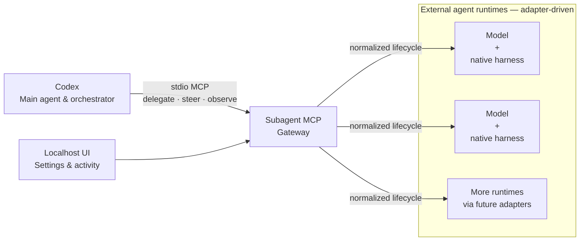

# README Positioning and Product-Flow Design

**Date:** 2026-08-21
**Status:** Approved for implementation

## Goal

Make the README explain Subagent MCP from the user's point of view:

- Codex is the main agent and orchestrator.
- Subagent MCP is the gateway from Codex to external agent runtimes.
- An external agent runtime is a model paired with its native harness.
- Runtime adapters are open-ended; Claude, Cursor, Qwen, and future integrations are examples, not architectural special cases.
- Codex can coordinate these external agents alongside its native subagents, supplementing that pool with separately managed runtimes and letting work use separate provider subscription quotas.

The opening must explain why this is useful. When the lead agent and every reviewer share the same model, harness, and context, independent criticism can blur—the same system can end up playing the match and refereeing it. Subagent MCP gives Codex a way to delegate to agents with different native harnesses, observe and steer their work, and make the final judgment itself.

The final prose should be written in natural, restrained English. It must not read like generated marketing copy or translate the Vietnamese metaphor literally. Claude Code should draft the opening through its own native harness once subscription-only execution is verified safe.

## Terminology

Use **external agent runtime** as the general term for a model plus its native harness. Use named combinations only as examples, such as:

- Claude + Claude Code
- a Cursor-supported model + Cursor's harness
- Qwen + its native harness

Do not make any one model, vendor, CLI, or harness the center of the architecture.

## Product-Flow Diagram

Keep the diagram focused on the public product flow. Do not expose deterministic test adapters, storage internals, or implementation scaffolding.

Follow the diagram with this idea in prose: a runtime may be Claude + Claude Code, Cursor + its model and harness, Qwen + its native harness, or another adapter. Examples belong in the caption or adjacent text, not as hard-coded architecture boxes.

## README Opening

The first section should cover, in this order:

1. The problem: one model/harness family acting as lead, worker, and reviewer reduces genuine independence.
2. The solution: Codex stays in control while Subagent MCP connects it to external model-and-harness combinations through one normalized lifecycle.
3. The practical benefit: separately managed external runtimes can work alongside Codex's native subagent pool, while using each provider's existing subscription quota.
4. The safety boundary: Subagent MCP must not activate usage credits or overage, and actual concurrency still depends on configured runtimes and provider limits.

Avoid claims that every future adapter already exists, that concurrency is unlimited, or that all harnesses expose identical capabilities.

## How to Use

Keep the quick path short and concrete:

1. Install the package and register the MCP server with Codex.
2. Open the localhost UI to configure and inspect an external agent runtime.
3. Start a new Codex task and delegate in natural language, for example: “Use Subagent MCP to ask an external agent to review this change, then independently evaluate its findings.”
4. Briefly map the lifecycle for advanced users: spawn, inspect or wait, send follow-up input or interrupt, then close.

Retain the truthful Windows preview status and the subscription-only/no-overage guard. Do not imply that unimplemented runtime adapters are available today.

## Acceptance Criteria

- The opening clearly states why Subagent MCP exists and keeps Codex as the main agent.
- The diagram has one gateway and generic model-plus-native-harness runtime boxes.
- Claude, Cursor, and Qwen appear only as examples outside the architecture boxes.
- The README explains installation, localhost configuration, natural-language delegation, and the lifecycle at a useful level.
- Capacity and quota benefits are described without promising unlimited concurrency or enabling paid overage.
- No private paths, internal product names, credentials, account details, or unpublished implementation claims appear.
